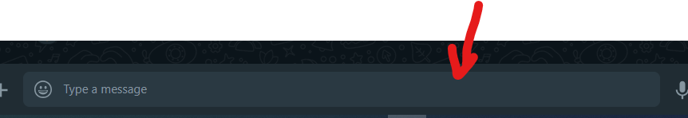

Este codigo es implementado en WhatsApp web, enviando un guion de pelicula selecionada para la personas selecionada.

PASOS:

1. Entrar a WhatsApp Web.
2. Inspecionar elemento (F12)dentro del chat.

3. Dirigirse a console del navegador.
4. Pegar el codigo copiado.
5. Enter y esperar que se envie el mensaje.

MEJORAS:

mejoras pronto....